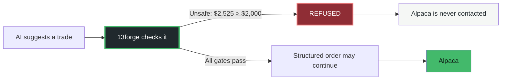
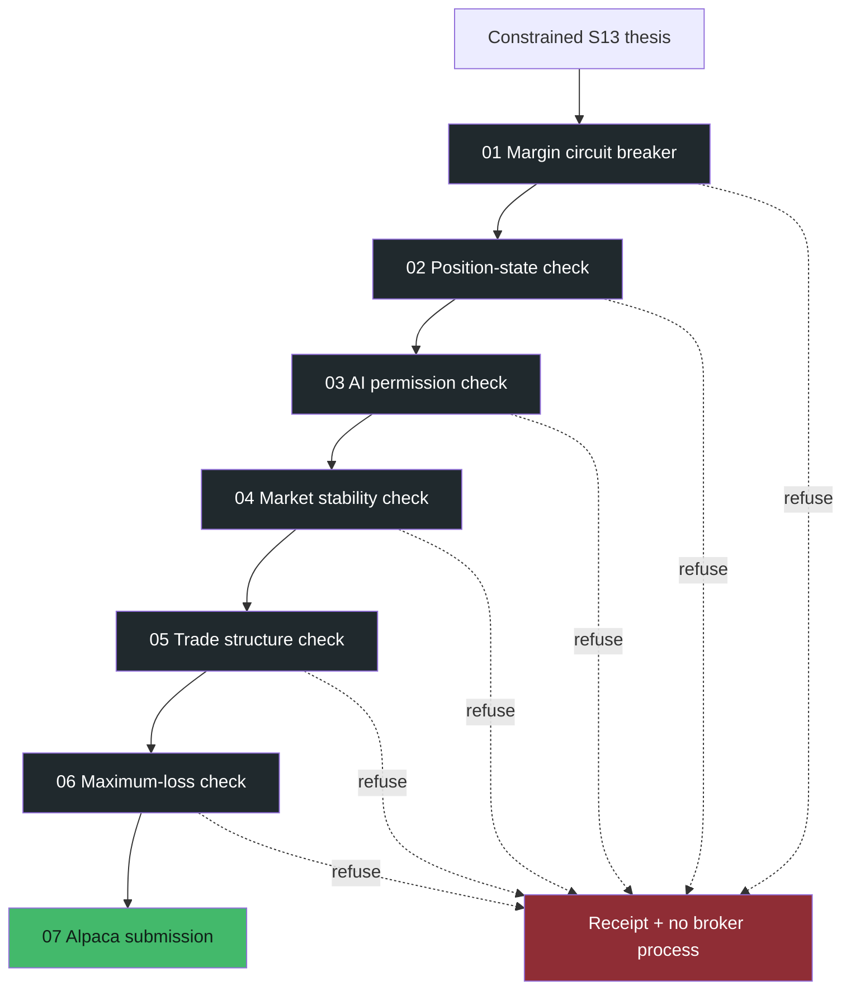
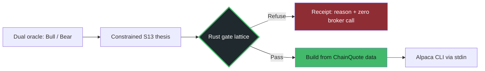

<div align="center">
  <picture>
    <source media="(prefers-color-scheme: dark)" srcset="./demo-portal/assets/brand/13forge-logo-dark.svg">
    
  </picture>

  <h1>AI can propose the trade. Rust decides if it is safe.</h1>
  <p><i>A proof-first execution airlock for autonomous options trading.</i></p>

  [](https://13forge-proof-portal.vercel.app/demo-portal/)
  [](https://github.com/deveraux-dev/AlpacaCOMP)
  [](https://github.com/deveraux-dev/AlpacaCOMP)
  [](https://alpaca.markets/)
</div>

## Start here

**[Open the live proof portal](https://13forge-proof-portal.vercel.app/demo-portal/)** | **[Print the UI/UX demo packet](https://13forge-proof-portal.vercel.app/demo-portal/print.html)** | **[Read the source](https://github.com/deveraux-dev/AlpacaCOMP)**

> **The 30-second version:** An AI may suggest an options trade, but it never gets a direct path to the broker. 13forge rebuilds the order from quoted market data, runs seven deterministic safety gates, and refuses the recorded trade when its calculated loss is `$2,525` against a `$2,000` ceiling. The broker process is never started.

### The moment that matters



This is the product in one sentence: **creative reasoning is allowed upstream; deterministic permission is required downstream.**

## Why it exists

Generative models are useful at finding ideas. They are not a safe place to put final authority over strikes, risk, or broker payloads. 13forge gives the model a narrow job and gives the execution path hard boundaries:

- the model emits a constrained thesis, not an order;
- strategy code uses real `ChainQuote` data to assemble the spread;
- seven refuse-by-default checks run before dispatch;
- only a mathematically bounded result can reach the Alpaca CLI.

The experience is designed to make a technical safety property feel obvious to a first-time judge: **the system proves what it refused, why it refused it, and what did not happen next.**

## Replay the proof

The deployed portal is a guided, static replay backed by repository evidence. It does not contain credentials, live balances, or a live order button.

| Step | What the judge sees | Why it matters |
| --- | --- | --- |
| 1 | An oversized iron condor proposal | A concrete failure, not an abstract architecture diagram |
| 2 | Seven checks run in sequence | Safety is a path, not a single marketing claim |
| 3 | `$2,525` maximum loss vs `$2,000` limit | The refusal is easy to verify mentally |
| 4 | `DispatchRefusal::MaxLossVeto` | The human explanation maps to code |
| 5 | "Broker process not started" | The system proves the prevented side effect |

**[Run the replay](https://13forge-proof-portal.vercel.app/demo-portal/)** | **[Download/print the packet](https://13forge-proof-portal.vercel.app/demo-portal/print.html)**

## The seven-gate path



The current path checks `GovernorVent` first, before the other refusal paths. The public receipt records **159/159 tests: 110 forge-gate + 36 forge-daemon + 13 example tests** for the `2026-09-02-night-governor` session.

## 🧾 Claim-proof ledger

We use a strict vocabulary so the README does not make a stronger claim than the code or receipt supports.

<table>
  <tr>
    <td width="50%">
      <h3>🔴 Live: Governor VENT Refusal</h3>
      <p><strong>Governor VENT blocks dispatch before the other checks.</strong> Backed by the <code>governor_vent_refuses_before_any_other_gate</code> test and the live Governor/dispatch path.</p>
    </td>
    <td width="50%">
      <h3>🛡️ Live: State & Risk Control</h3>
      <p><strong>Position-state, oracle, market, geometry, and max-loss checks control dispatch.</strong> Backed by dispatch code and refusal tests.</p>
    </td>
  </tr>
  <tr>
    <td width="50%">
      <h3>🚫 Tested: $2,525 Max Loss Veto</h3>
      <p><strong>A $2,525 maximum loss exceeds the $2,000 ceiling.</strong> Proven by the recorded oversized-condor refusal case.</p>
    </td>
    <td width="50%">
      <h3>✅ Verified: Negative Credit Pricing</h3>
      <p><strong>Credit prices serialize as negative Alpaca mleg limit prices.</strong> Backed by the <code>mleg_body</code> Alpaca convention test.</p>
    </td>
  </tr>
  <tr>
    <td width="50%">
      <h3>📏 Tested: Quoted Strikes & Wing Caps</h3>
      <p><strong>Strategy uses quoted strikes and pulls wings inside the cap.</strong> Backed by robust strategy tests.</p>
    </td>
    <td width="50%">
      <h3>⚙️ Support: Core Components</h3>
      <p><strong>Merkle seal, Fredholm residue, and API pacer.</strong> Built components, not presented as live gates.</p>
    </td>
  </tr>
</table>

Metrics such as win rate, profit factor, latency, fills, and account balances are intentionally omitted until a fresh receipt supports them.

## Architecture in plain English



The model is useful because it proposes a thesis. The Rust path is trusted because it owns permission, risk, structure, and serialization boundaries.

## 🔍 Judge lens

**Best-practice inference, not an event-specific official rubric:** hackathon judges tend to reward a focused problem, a working public demo, meaningful technology use, originality, and a clear explanation. This README makes each visible in the same order a judge experiences the submission:

<table>
  <tr>
    <td width="50%">
      <h3>🎯 What problem is solved?</h3>
      <p>AI-generated trading ideas need a deterministic safety boundary.</p>
    </td>
    <td width="50%">
      <h3>⏱️ Can I understand it quickly?</h3>
      <p>One replay, one refusal, one visible dollar comparison.</p>
    </td>
  </tr>
  <tr>
    <td width="50%">
      <h3>💻 Is the technology meaningful?</h3>
      <p>Rust gates own the final permission path; AI does not write orders.</p>
    </td>
    <td width="50%">
      <h3>🧾 Is there proof?</h3>
      <p>Code references, refusal receipts, and a reproducible test session.</p>
    </td>
  </tr>
  <tr>
    <td colspan="2">
      <h3>🧠 What is memorable?</h3>
      <p>The system proves a dangerous order never reached the broker.</p>
    </td>
  </tr>
</table>

The psychology is simple: reduce cognitive load, show a concrete consequence, and make trust visible through a receipt. A judge should feel oriented before they feel impressed.

## Run locally

The proof portal is plain static HTML and can be opened directly or served from the repository root. The Rust workspace requires a local Rust toolchain.

```bash
# Set Alpaca paper credentials only in the current shell.
export APCA_API_KEY_ID="your_key_id"
export APCA_API_SECRET_KEY="your_secret_key"

# Run the current workspace verification.
cargo test -p forge-gate -p forge-daemon

# Dry-run strategy selection; no order is placed.
cargo run --example sim_today -p forge-daemon

# Read-only account smoke test.
cargo run --example live_smoke -p forge-daemon
```

## Links and ownership

- **Live proof portal:** https://13forge-proof-portal.vercel.app/demo-portal/
- **Print packet:** https://13forge-proof-portal.vercel.app/demo-portal/print.html
- **Proof metadata:** https://13forge-proof-portal.vercel.app/demo-portal/proof-data.json
- **Source repository:** https://github.com/deveraux-dev/AlpacaCOMP

This submission is maintained from a collaborator lane: frontend demo portal, README/docs, deployment preview, and presentation assets. The Rust engine, credentials, live trading behavior, and trading receipts remain owned by the core repository maintainers. Frontend copy mirrors backend receipts without editing backend code.

*Demo video URL can be added after the final recording.*

---

<div align="center"><b>13forge</b> | Proof-first autonomous options execution</div>
