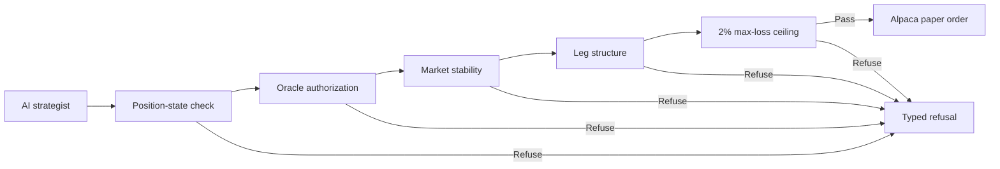

<div align="center">

# 13forge

**AI proposes. Deterministic Rust gates decide.**

[Open the proof portal](https://13forge-proof-portal-sehrishmajeed08-2635s-projects.vercel.app)

</div>

## What It Does

13forge is an autonomous options-trading agent built in Rust for Alpaca paper trading. The model may propose a trade, but it cannot submit an order directly.

Before Alpaca is contacted, every spread passes the same checks:

1. Position-state transition
2. Oracle authorization
3. Market stability
4. Option-leg structure
5. Maximum potential loss

Only an order that passes every check reaches the Alpaca multi-leg submission step.

## Proof Portal

The [deployed portal](https://13forge-proof-portal-sehrishmajeed08-2635s-projects.vercel.app) replays a code-backed refusal:

```text
Proposed put wing: 29 points
Credit received:   $3.75
Maximum loss:      $2,525
Allowed ceiling:   $2,000
Result:            REFUSED BEFORE ALPACA
```

The portal is a static evidence replay. It contains no credentials, does not place orders, and does not display invented live metrics.

## Architecture



## Code-Backed Behaviors

| Behavior | Source |
|---|---|
| Position-state check runs first | `crates/forge-daemon/src/dispatch.rs` |
| Oracle verdict can refuse execution | `DispatchRefusal::VerdictVeto` |
| Out-of-band market structure is refused | `DispatchRefusal::ChaoticBook` |
| Invalid spread geometry is refused | `DispatchRefusal::MalformedLegs` |
| Loss above 2% is refused | `DispatchRefusal::MaxLossVeto` |
| Credit prices serialize as negative values | `credit_entry_limit_price_is_negative_per_alpaca_mleg_convention` |
| Multi-leg JSON is sent through standard input | `run_with_stdin(..., "@-")` |
| Condors and butterflies use supplied chain quotes | `crates/forge-daemon/src/strategy.rs` |

The detailed evidence mapping is in [`docs/CLAIM_PROOF_MAP.md`](docs/CLAIM_PROOF_MAP.md).

## Run the Portal Locally

No frontend build step or API key is required.

```bash
python -m http.server 4173
```

Open `http://localhost:4173/`.

## Verify the Rust Workspace

```bash
cargo test -p forge-gate -p forge-daemon
```

Alpaca credentials are required only for broker-connected examples. Credentials are not stored in the frontend.

## Technology

- Rust
- `no_std`, unsafe-denied gate core
- Alpaca Trading API and CLI
- Static HTML, CSS, and JavaScript proof portal

## Disclaimer

This hackathon project demonstrates paper-trading infrastructure and is not financial advice or production brokerage software.
