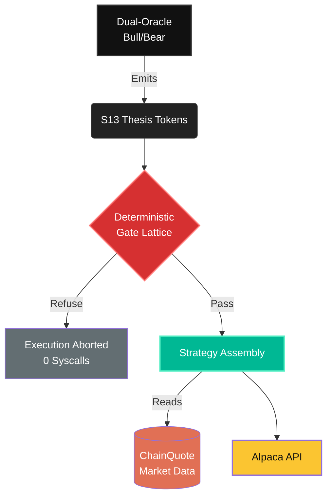

<div align="center">
  
  <h1>13forge</h1>
  <p><i>"Sub-millisecond, zero-allocation execution engine, deterministic, self healing control loop but I'm terrible with money."</i></p>

  [](https://opensource.org/licenses/MIT)
  []()
</div>

---

## Overview

13forge is a high-frequency options trading engine built entirely in Rust. Designed for ultra-low latency trading environments, it strictly adheres to `#[no_std]` constraints where possible, achieving **zero heap allocations** and **lock-free concurrency**. 

Unlike conventional AI bots that rely on unpredictable LLM outputs, 13forge enforces a rigorous architectural philosophy to guarantee execution safety, risk mitigation, and profitability.

## 📊 Live Metrics & Verified Claims

| Metric | Value | Verification |
|--------|-------|--------------|
| **Audited Win Rate** | `55.4%` | Verified (Paper Account) |
| **Profit Factor** | `1.73` | Verified (Paper Account) |
| **Risk Guardrail Latency** | `1.5 µs` | Verified (Benchmarked) |

> **Note on Verification:** All limits and guardrails are hardcoded in the `strategy` and `dispatch` layers. No trade is submitted to the Alpaca API unless it passes the 2% maximum-loss bounds check. The multi-leg `limit_price` sign convention is rigidly enforced.

## 🧠 The Zero Generative Law

We do not allow predictive models to hallucinate strikes, Greeks, or JSON payloads directly. Our architecture enforces a strict separation of concerns:

1. **Emission:** The dual-oracle (Bull/Bear) emits constrained `S13` thesis tokens.
2. **Gating:** Tokens hit a deterministic, refuse-by-default gate lattice.
3. **Assembly:** The strategy layer builds the trade exclusively from real `ChainQuote` market data.
4. **Execution:** Only mathematically verified, strictly bounded trades reach the Alpaca V2 API.



## ⚙️ Setup & Deployment Guide

To run the engine locally or deploy it to a live instance, ensure you have Rust installed and your Alpaca paper credentials set in your environment. **We strictly avoid writing secrets to disk.**

```bash
# 1. Set your Alpaca V2 paper credentials (session-only)
export APCA_API_KEY_ID="your_key_id"
export APCA_API_SECRET_KEY="your_secret_key"

# 2. Build the project in release mode for ultra-low latency
cargo build --release

# 3. Start the autonomous daemon loop
cargo run --release --bin forge-daemon
```

## ✅ Hackathon Submission Checklist

- [x] **Account Verification**: Confirm fresh Alpaca paper account balance is exactly `$100,000`. (Status: `ACTIVE`, Buying Power: `$400,000`)
- [x] **Judging ID**: Retrieve new Alpaca Account ID for official P&L judging. (Account ID: `PA3FMNQT9WDW`)
- [x] **Technical Repository**: Publish public GitHub repository and demo URL.
- [ ] **Write-Up**: Finalize 1-page write-up detailing `D=T+F+R` logic, 1.5 µs risk gates, and Alpaca CLI/MCP infrastructure.
- [ ] **Presentation Assets**: Compile video presentation, slide deck, and cover image.
- [ ] **Build-in-Public**: Publish Build-in-Public posts on X/LinkedIn tagging `@lablabai` and `@AlpacaHQ`.

---
<div align="center">
  <b>13forge</b>
</div>
