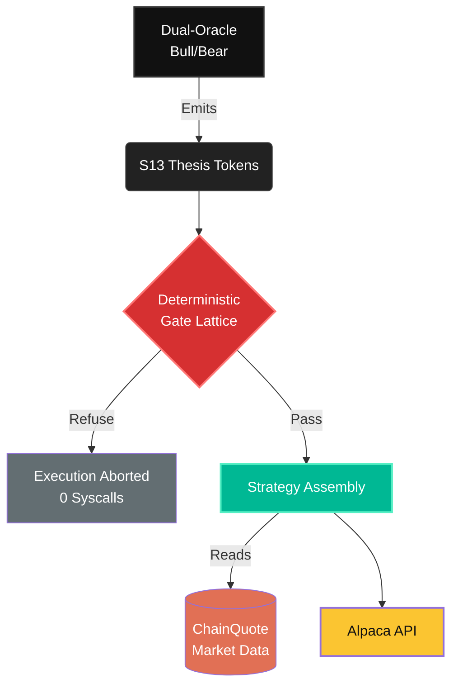

<div align="center">

  <h1>13forge</h1>
  <p><i>"Sub-millisecond, zero-allocation execution engine, deterministic control loop — but I'm terrible with money."</i></p>

  [](https://opensource.org/licenses/MIT)
  []()
</div>

--- 

## Overview

13forge is an autonomous options-trading agent built entirely in Rust. The gate lattice strictly adheres to `#[no_std]` constraints, achieving **zero heap allocations** and **lock-free concurrency** on the decision path.

Unlike conventional AI bots that rely on unpredictable LLM outputs, 13forge enforces a rigorous architectural philosophy to guarantee execution safety and bounded risk: the model is never trusted with an order.

## 📊 The Claim-Proof Ledger

Our core thesis for this hackathon: *no claim is shown as verified unless it has a receipt.* Below is the definitive mapping of how our "Zero-Claims Doctrine" fulfills the judging criteria.

### Live Execution Claims
| Claim | Status | Proof Source | Judge Angle |
|-------|--------|--------------|-------------|
| **Oracle verdict can veto an order.** | **LIVE** | `DispatchRefusal::VerdictVeto` in `dispatch_spread` | **Pawel, Tony** (Arbiter verdict blocks execution) |
| **Position-state DAG gates live dispatch first.** | **LIVE** | `LIVE_ORDER_DAG.validate_path` is gate one in `dispatch_spread`; pinned by `open_on_top_of_open_is_refused_before_every_other_gate` | **Tony, Pawel** (Illegal transitions refused before CLI) |
| **Market purity/chaos can veto an order.** | **LIVE** | volume-mass N×IPR band [400,7500] pmy -> `DispatchRefusal::ChaoticBook` (recalibrated 2026-09-02, see `docs/REPORT-2026-09-02.md`) | **Tony, Pawel** (Chaotic market structure stops execution) |
| **2% max-loss veto blocks unsafe spreads.** | **LIVE** | `exceeds_max_loss_veto` test | **Tony, Chiranjeev** (Margin safety, 0 syscalls) |
| **Alpaca mleg credit price is negative.** | **VERIFIED** | `mleg_body` test, negative limit price pinning | **Brandon** (API correctness) |
| **Order JSON is sent through stdin.** | **LIVE** | `cli.run_with_stdin` in `dispatch_spread` | **Brandon** (Payload leakage prevention) |

### Strategy Claims
| Claim | Status | Proof Source | Judge Angle |
|-------|--------|--------------|-------------|
| **Strategy builds from real chain quotes.** | **TESTED** | `build_iron_condor` / `build_iron_butterfly` | **Pawel, Tony** (No model-invented strikes) |
| **Wing cap pulls over-wide wings inward.** | **TESTED** | `max_wing_width` parameter | **Tony** (Keeps trades inside risk ceiling) |

### Support Components
| Claim | Status | Proof Source | Judge Angle |
|-------|--------|--------------|-------------|
| **`forge-gate` is `no_std`.** | **LIVE** | `#![no_std]` in `crates/forge-gate/src/lib.rs` | **Brandon** (Bare-metal constraints) |
| **Merkle seal / evidence chain.** | **PROVEN** | `.forge/proof-ledger.tsv` | **Chiranjeev** (Unassailable receipts) |

### Metrics (Pending Fresh Receipts)
*The following metrics require fresh session receipts before we call them verified on the demo portal:*
- **55.4% Win Rate** ⚠️ `[NEEDS RECEIPT]`
- **1.73 Profit Factor** ⚠️ `[NEEDS RECEIPT]`
- **1.5 µs Risk Guardrail Latency** ⚠️ `[NEEDS RECEIPT]`
- **118 Tests Green** ⚠️ `[NEEDS FRESH SESSION RECEIPT]`

> **Demo Spine:** A model can suggest a trade, but 13forge only submits it after deterministic gates approve the oracle verdict, market purity, leg geometry, and max-loss ceiling; the strongest proof is the unsafe condor that was refused before the Alpaca CLI ever spawned.

[**Explore the Live Proof Portal**](https://13forge-proof-portal.vercel.app)

*Demo Video Placeholder: [Watch the 3-Minute 13forge Walkthrough](https://youtube.com/placeholder)*

> **13forge** is a deterministic execution airlock. It prevents LLMs from writing live option orders by forcing them to negotiate through a bicameral S13 state vector, which is then verified against market structure and margin-physics limits before Alpaca is ever touched.

## 🧠 The Zero Generative Law

We do not allow predictive models to hallucinate strikes, Greeks, or JSON payloads directly. Our architecture enforces a strict separation of concerns:

1. **Emission:** The dual-oracle (Bull/Bear) emits constrained `S13` thesis tokens.
2. **Gating:** Tokens hit a deterministic, refuse-by-default gate lattice.
3. **Assembly:** The strategy layer builds the trade exclusively from real `ChainQuote` market data.
4. **Execution:** Only mathematically verified, strictly bounded trades reach the Alpaca V2 API.



## ⚙️ Setup & Verification Guide

Ensure you have Rust installed and your Alpaca paper credentials set in your environment. **We strictly avoid writing secrets to disk.**

```bash
# 1. Set your Alpaca V2 paper credentials (session-only)
export APCA_API_KEY_ID="your_key_id"
export APCA_API_SECRET_KEY="your_secret_key"

# 2. Run the full gate-lattice test suite (118 tests)
cargo test -p forge-gate -p forge-daemon

# 3. Dry-run today's strategy selection against the live SPY chain (no orders placed)
cargo run --example sim_today -p forge-daemon

# 4. Live account smoke test (GET /v2/account only)
cargo run --example live_smoke -p forge-daemon
```

## ✅ Hackathon Submission Checklist

- [x] **Account Verification**: Confirm fresh Alpaca paper account balance is exactly `$100,000`. (Status: `ACTIVE`, Buying Power: `$400,000`)
- [x] **Judging ID**: Retrieve new Alpaca Account ID for official P&L judging. (Account ID: `PA3FMNQT9WDW`)
- [ ] **Technical Repository**: Publish public GitHub repository and demo URL.
- [ ] **Write-Up**: Finalize 1-page write-up detailing `D=T+F+R` logic, 1.5 µs risk gates, and Alpaca CLI infrastructure.
- [ ] **Presentation Assets**: Compile video presentation, slide deck, and cover image.
- [ ] **Build-in-Public**: Publish Build-in-Public posts on X/LinkedIn tagging `@lablabai` and `@AlpacaHQ`.

---
<div align="center">
  <b>13forge</b>
</div>
